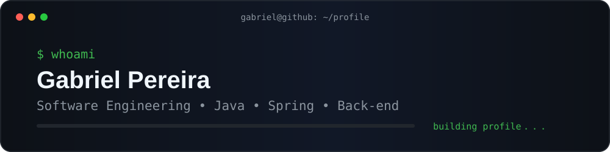
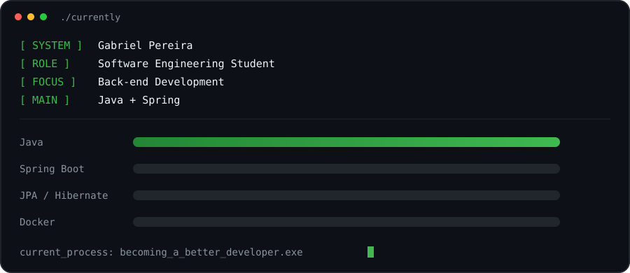
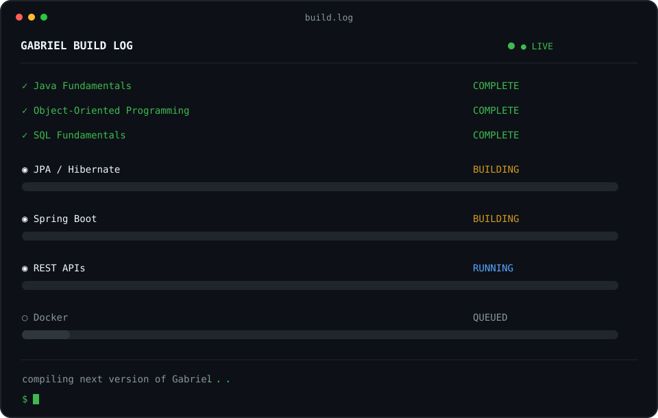
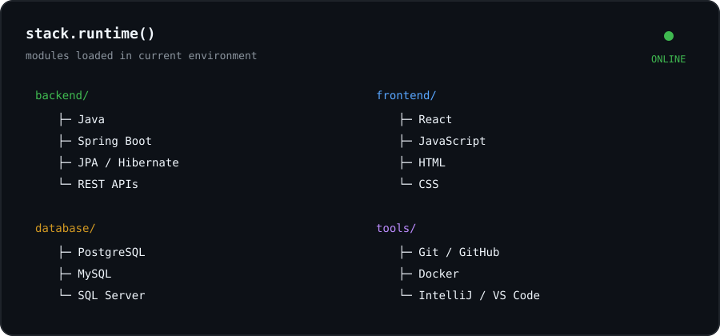
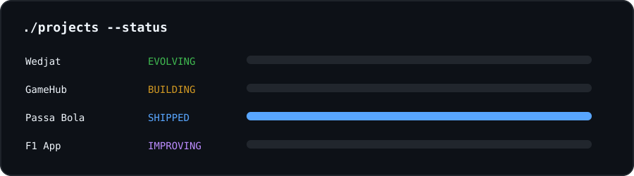
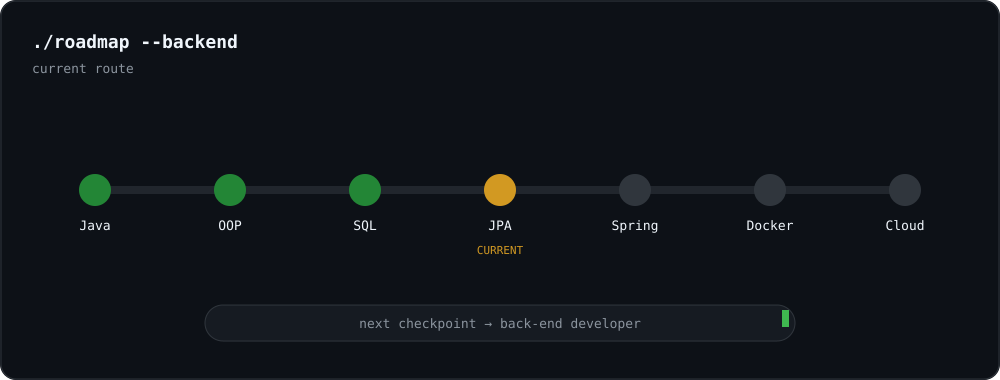
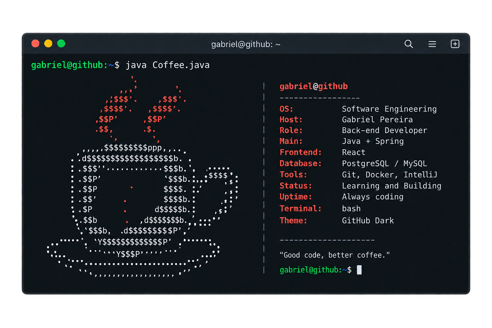

<!-- ===================================================== -->
<!--                     HEADER                            -->
<!-- ===================================================== -->

<div align="center">
  
</div>

<br/>

<div align="center">

### `Software Engineering Student • Back-end • Java & Spring`

</div>

---

<!-- ===================================================== -->
<!--                      ABOUT                            -->
<!-- ===================================================== -->

## `> whoami`

```console
gabriel@github:~$ whoami

Name:      Gabriel Pereira
Role:      Software Engineering Student
Focus:     Back-end Development
Main:      Java + Spring
Frontend:  React
Status:    Learning & Building
```

Sou estudante de **Engenharia de Software** e estou construindo minha trajetória em desenvolvimento de software, com foco principalmente no ecossistema **Java e Spring**.

Gosto de aprender através da prática, construindo projetos que me façam entender não apenas **como implementar**, mas também como estruturar soluções de forma organizada, escalável e seguindo boas práticas.

Atualmente, meu objetivo é evoluir cada vez mais em **Back-end**, APIs REST, persistência de dados, arquitetura de aplicações e desenvolvimento Full Stack.

---

<!-- ===================================================== -->
<!--                    CURRENTLY                          -->
<!-- ===================================================== -->

## `> ./currently`

<div align="center">
  
</div>

---

<!-- ===================================================== -->
<!--                     BUILD LOG                         -->
<!-- ===================================================== -->

## `> cat build.log`

<div align="center">
  
</div>

---

<!-- ===================================================== -->
<!--                       STACK                           -->
<!-- ===================================================== -->

## `> stack.runtime()`

<div align="center">
  
</div>

<br/>

<div align="center">


</div>

---

<!-- ===================================================== -->
<!--                     PROJECTS                          -->
<!-- ===================================================== -->

## `> ./projects --status`

<div align="center">
  
</div>

<br/>

<table>
<tr>

<td width="50%" valign="top">

<h3 align="center">🧠 Wedjat</h3>

<div align="center">

`AI` `NLP` `BERTimbau` `Data Science`

</div>

<br/>

Plataforma de **inteligência comercial** desenvolvida durante o Challenge **FIAP x TOTVS**.

O projeto utiliza dados e transcrições de reuniões para gerar informações estratégicas e apoiar equipes comerciais antes, durante e depois das reuniões.

```console
type: AI / Data
status: evolving...
```

</td>

<td width="50%" valign="top">

<h3 align="center">🎮 GameHub</h3>

<div align="center">

`Java` `Spring` `React` `REST API`

</div>

<br/>

Aplicação Full Stack voltada para exploração e gerenciamento de jogos.

Também funciona como laboratório para meus estudos de **Java, Spring Boot, APIs REST e arquitetura Full Stack**.

```console
type: full-stack
status: building...
```

</td>

</tr>

<tr>

<td width="50%" valign="top">

<h3 align="center">⚽ Passa Bola</h3>

<div align="center">

`React Native` `Expo` `JavaScript`

</div>

<br/>

Aplicação mobile voltada para gerenciamento de campeonatos, inscrições, jogadores e rankings.

```console
type: mobile
status: shipped ✓
```

</td>

<td width="50%" valign="top">

<h3 align="center">🏎️ F1 App</h3>

<div align="center">

`React` `TypeScript` `API`

</div>

<br/>

Aplicação para consulta de corredores, circuitos, temporadas e outras informações relacionadas à Fórmula 1.

```console
type: frontend
status: improving...
```

</td>

</tr>
</table>

---

<!-- ===================================================== -->
<!--                      ROADMAP                          -->
<!-- ===================================================== -->

## `> ./roadmap --backend`

<div align="center">
  
</div>

---

<!-- ===================================================== -->
<!--                   DEVELOPER CONFIG                    -->
<!-- ===================================================== -->

## `> cat Gabriel.java`

```java
public class Gabriel {

    private final String role =
            "Software Engineering Student";

    private final String focus =
            "Back-end Development";

    private final String mainLanguage =
            "Java";

    private boolean learning = true;
    private boolean building = true;

    public void dailyRoutine() {

        while (learning) {

            study();

            build();

            breakThings();

            debug();

            improve();

        }

    }
}
```

---

<!-- ===================================================== -->
<!--                    GITHUB ACTIVITY                    -->
<!-- ===================================================== -->

## `> git log --activity`

```console
gabriel@github:~$ git status

On branch main

Current status:
    modified: knowledge
    modified: experience
    modified: projects

Changes not staged for stopping.

nothing to commit, keep coding.
```

---

<!-- ===================================================== -->
<!--                       CONNECT                         -->
<!-- ===================================================== -->

## `> ./connect`

<div align="center">

<a href="https://github.com/GabeAugust">
  
</a>


</div>

<br/>

```console
gabriel@github:~$ ping network

> looking for interesting projects...
> looking for new technologies...
> looking for developers...
> looking for new challenges...

connection: AVAILABLE ✓
```

---

<!-- ===================================================== -->
<!--                    JAVA COFFEE                        -->
<!-- ===================================================== -->


<div align="center">
  
</div>


<div align="center">

### `Good code, better coffee.` ☕

`build → break → debug → learn → repeat`

</div>